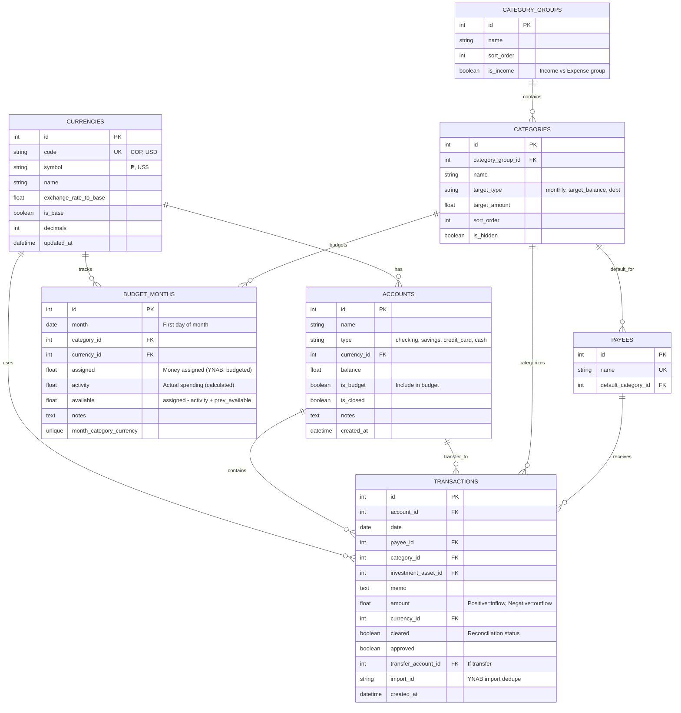

# 🗄️ Estructura de Base de Datos - Personal Finances

## Diagrama de Entidad-Relación



## Tablas Principales

### 1. **currencies** - Monedas
Gestiona las monedas soportadas (COP, USD) con tasas de cambio.

**Campos importantes:**
- `code`: Código ISO de 3 letras (COP, USD)
- `exchange_rate_to_base`: Tasa de conversión a moneda base (COP)
- `is_base`: Marca la moneda base
- `decimals`: Cantidad de decimales para mostrar

### 2. **accounts** - Cuentas Bancarias
Todas las cuentas financieras del usuario.

**Tipos de cuenta:**
- `checking`: Cuenta corriente
- `savings`: Cuenta de ahorros
- `credit_card`: Tarjeta de crédito
- `cash`: Efectivo

**Campos importantes:**
- `balance`: Saldo actual (calculado automáticamente)
- `is_budget`: Si se incluye en el presupuesto
- `currency_id`: Cada cuenta tiene una moneda específica

### 3. **category_groups** - Grupos de Categorías
Organiza las categorías en grupos (estilo YNAB).

**Grupos predefinidos:**
- Gastos Esenciales
- Obligaciones Financieras
- Gastos Discrecionales
- Ahorros
- Ingresos (marcado con `is_income=true`)

### 4. **categories** - Categorías
Categorías individuales para clasificar transacciones.

**Ejemplos:**
- Vivienda (en Gastos Esenciales)
- Hipoteca (en Obligaciones Financieras)
- Entretenimiento (en Gastos Discrecionales)
- Salario (en Ingresos)

**Campos importantes:**
- `target_type`: Tipo de meta (mensual, balance objetivo, deuda)
- `target_amount`: Monto objetivo para la categoría

### 5. **payees** - Beneficiarios
Personas o entidades que reciben/envían dinero.

**Características:**
- `default_category_id`: Categoría asignada automáticamente
- Permite auto-categorización de transacciones recurrentes

### 6. **transactions** - Transacciones
Registro de todas las transacciones financieras.

**Campos importantes:**
- `amount`:
  - Positivo = Ingreso (inflow)
  - Negativo = Gasto (outflow)
- `investment_asset_id`: Vincula un ingreso con una inversión registrada
- `cleared`: Estado de reconciliación (confirmado vs pendiente)
- `transfer_account_id`: Si es transferencia entre cuentas
- `import_id`: ID único para evitar duplicados al importar de YNAB

### 7. **budget_months** - Presupuesto Mensual (Estilo YNAB)
Implementa el principio "Give every dollar a job".

**Campos importantes:**
- `month`: Primer día del mes (2026-01-01)
- `assigned`: Dinero asignado a esta categoría este mes
- `activity`: Gasto real del mes (calculado desde transactions)
- `available`: Dinero disponible = assigned - activity + mes_anterior

**Restricción única:** Solo un registro por mes + categoría + moneda

## Relaciones Clave

### Multi-Moneda
- Cada **account** tiene una `currency_id`
- Cada **transaction** tiene una `currency_id`
- Cada **budget_month** tiene una `currency_id`
- Permite presupuestos separados para COP y USD

### Transferencias
- Las **transactions** pueden tener `transfer_account_id`
- Representa movimiento de dinero entre cuentas del usuario
- No consumen presupuesto (son movimientos internos)

### Presupuesto YNAB
- **budget_months** vincula: mes + categoría + moneda
- `assigned`: Cuánto planeas gastar
- `activity`: Cuánto realmente gastaste (suma de transactions)
- `available`: Cuánto te queda (incluye rollover del mes anterior)

### Importación YNAB
- **transactions** tienen `import_id` único
- Formato: `ynab_{account}_{date}_{amount}_{payee}`
- Evita duplicados al importar múltiples veces

## Índices Importantes

```sql
-- Transacciones ordenadas por fecha
CREATE INDEX idx_transactions_date ON transactions(date DESC);

-- Presupuesto por mes
CREATE INDEX idx_budget_months_month ON budget_months(month);

-- Búsqueda de transacciones por cuenta
CREATE INDEX idx_transactions_account ON transactions(account_id);

-- Búsqueda de transacciones por categoría
CREATE INDEX idx_transactions_category ON transactions(category_id);
```

## Queries Comunes

### 1. Balance total por moneda
```sql
SELECT
    c.code,
    c.symbol,
    SUM(a.balance) as total
FROM accounts a
JOIN currencies c ON a.currency_id = c.id
WHERE a.is_closed = FALSE
GROUP BY c.code;
```

### 2. Gastos del mes por categoría
```sql
SELECT
    cg.name as group_name,
    cat.name as category_name,
    SUM(ABS(t.amount)) as total
FROM transactions t
JOIN categories cat ON t.category_id = cat.id
JOIN category_groups cg ON cat.category_group_id = cg.id
WHERE
    t.amount < 0
    AND strftime('%Y-%m', t.date) = '2026-01'
GROUP BY cg.name, cat.name
ORDER BY total DESC;
```

### 3. Presupuesto vs Real (mes actual)
```sql
SELECT
    c.name as category,
    b.assigned,
    ABS(b.activity) as spent,
    b.available,
    CASE
        WHEN b.assigned > 0 THEN (ABS(b.activity) / b.assigned * 100)
        ELSE 0
    END as percent_used
FROM budget_months b
JOIN categories c ON b.category_id = c.id
WHERE b.month = '2026-01-01'
ORDER BY percent_used DESC;
```

### 4. Top 10 beneficiarios por gasto
```sql
SELECT
    p.name,
    COUNT(*) as transactions,
    SUM(ABS(t.amount)) as total_spent
FROM transactions t
JOIN payees p ON t.payee_id = p.id
WHERE t.amount < 0
GROUP BY p.name
ORDER BY total_spent DESC
LIMIT 10;
```

## Migración y Seeders

### Datos Iniciales
- **currencies**: COP (base) y USD
- **category_groups**: 5 grupos predefinidos
- **categories**: ~20 categorías predefinidas
- **accounts**: 2 cuentas de ejemplo (opcional)

### Secuencia de Inicialización
1. Crear todas las tablas
2. Insertar currencies
3. Insertar category_groups
4. Insertar categories
5. Opcionalmente, crear accounts de ejemplo

Ver: `src/finance_app/init_db.py` para la implementación.
