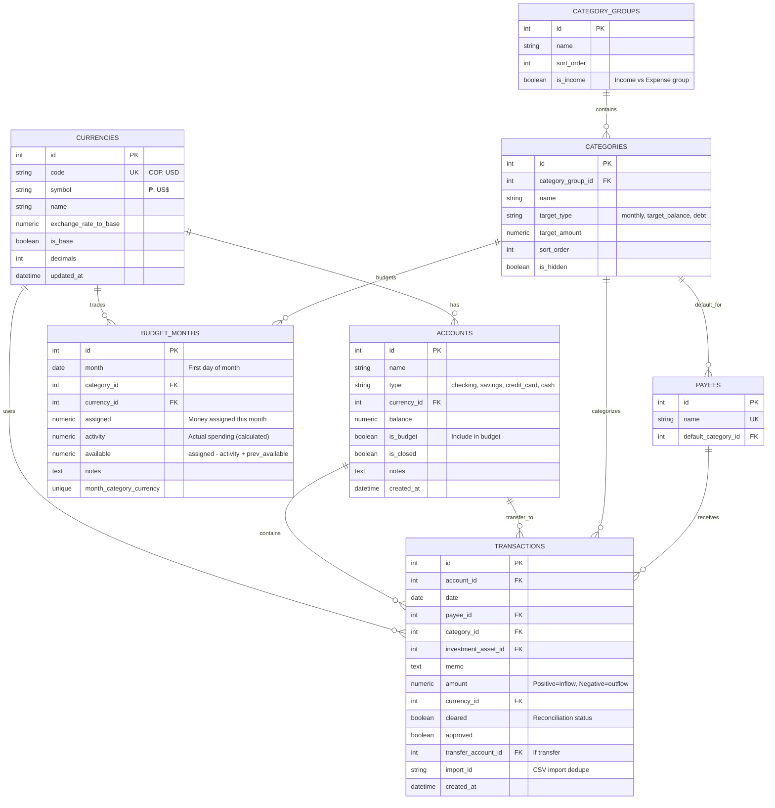

# Database Schema - Personal Finances

## Entity-Relationship Diagram



## Core Tables

### 1. **currencies**
Manages supported currencies (COP, USD) with exchange rates.

**Key fields:**
- `code`: ISO 3-letter code (COP, USD)
- `exchange_rate_to_base`: Conversion rate to base currency (COP)
- `is_base`: Marks the base currency
- `decimals`: Number of decimal places to display

### 2. **accounts**
All financial accounts belonging to the user.

**Account types:**
- `checking`: Checking account
- `savings`: Savings account
- `credit_card`: Credit card
- `cash`: Physical cash

**Key fields:**
- `balance`: Current balance (auto-calculated from transactions)
- `is_budget`: Whether to include in the budget
- `currency_id`: Each account has a single currency

### 3. **category_groups**
Organizes categories into groups.

**Pre-seeded groups:**
- Essential Expenses (Gastos Esenciales)
- Financial Obligations (Obligaciones Financieras)
- Discretionary Spending (Gastos Discrecionales)
- Savings (Ahorros)
- Income — marked with `is_income=true`

### 4. **categories**
Individual categories for classifying transactions.

**Examples:**
- Housing (in Essential Expenses)
- Mortgage (in Financial Obligations)
- Entertainment (in Discretionary Spending)
- Salary (in Income)

**Key fields:**
- `target_type`: Goal type (`monthly`, `target_balance`, `debt`)
- `target_amount`: Target amount for the category

### 5. **payees**
People or entities that send/receive money.

**Features:**
- `default_category_id`: Auto-assigned category for recurring payees
- Enables auto-categorization of recurring transactions

### 6. **transactions**
Record of all financial transactions.

**Key fields:**
- `amount`:
  - Positive = Income (inflow)
  - Negative = Expense (outflow)
- `investment_asset_id`: Links income to a registered investment
- `cleared`: Reconciliation status (confirmed vs pending)
- `transfer_account_id`: If it is an inter-account transfer
- `import_id`: Unique ID to deduplicate CSV imports

### 7. **budget_months** — Monthly Budget
Implements the "Give every dollar a job" principle.

**Key fields:**
- `month`: First day of the month (e.g., 2026-01-01)
- `assigned`: Money assigned to this category this month
- `activity`: Actual spending (calculated from transactions)
- `available`: Money remaining = assigned - activity + previous month rollover

**Unique constraint:** One record per month + category + currency

## Patrimonio Tables

### **patrimonio_assets**
Assets tracked in the net worth module.

**Asset types:** `inmueble` (real estate), `vehiculo` (vehicle), `otro` (other)

**Key fields:**
- `valor_adquisicion`: Original acquisition value (`Numeric(18,2)`)
- `fecha_adquisicion`: Acquisition date
- `tasa_anual`: Annual appreciation/depreciation rate
- `metodo_depreciacion`: Depreciation method (`linea_recta`, `saldo_decreciente`, `doble_saldo_decreciente`)
- `return_rate`: Annual return percentage (for investment-type assets)
- `return_amount`: Fixed annual return amount
- `moneda_id`: Currency FK

**Valuation formula:**
```
value = valor_adquisicion * (1 + tasa_anual) ^ max(0, year - year_acquisition - 1)
```
Acquisition year returns original value. Years before acquisition return 0.

### **debts** (single source of truth)
All debts — managed via `/debts`, read by Patrimonio.

**Debt types:** `mortgage`, `credit_loan`, `credit_card`

> Credit cards (`credit_card`) are excluded from net worth calculations. Only `mortgage` and `credit_loan` appear in Patrimonio.

### **debt_amortization_monthly**
Monthly amortization records per debt. Uses `Numeric(18,2)` for all monetary columns.

## Key Relationships

### Multi-Currency
- Each `account` has a `currency_id`
- Each `transaction` has a `currency_id`
- Each `budget_month` has a `currency_id`
- Each `patrimonio_asset` has a `moneda_id`
- Enables separate COP and USD budgets and multi-currency net worth

### Transfers
- `transactions` may have a `transfer_account_id`
- Represents money movement between the user's own accounts
- Does not consume budget (internal movement)

### Budget Logic
- `budget_months` links: month + category + currency
- `assigned`: How much you planned to spend
- `activity`: How much you actually spent (sum of transactions)
- `available`: How much remains (includes previous month rollover)

### CSV Import
- `transactions` have a unique `import_id`
- Format: `csv_{account}_{date}_{amount}_{payee}`
- Prevents duplicates when importing multiple times

## Important Indexes

```sql
-- Transactions ordered by date
CREATE INDEX idx_transactions_date ON transactions(date DESC);

-- Budget lookup by month
CREATE INDEX idx_budget_months_month ON budget_months(month);

-- Transactions by account
CREATE INDEX idx_transactions_account ON transactions(account_id);

-- Transactions by category
CREATE INDEX idx_transactions_category ON transactions(category_id);
```

## Common Queries

### 1. Total balance by currency
```sql
SELECT
    c.code,
    c.symbol,
    SUM(a.balance) AS total
FROM accounts a
JOIN currencies c ON a.currency_id = c.id
WHERE a.is_closed = FALSE
GROUP BY c.code;
```

### 2. Monthly spending by category
```sql
SELECT
    cg.name AS group_name,
    cat.name AS category_name,
    SUM(ABS(t.amount)) AS total
FROM transactions t
JOIN categories cat ON t.category_id = cat.id
JOIN category_groups cg ON cat.category_group_id = cg.id
WHERE
    t.amount < 0
    AND strftime('%Y-%m', t.date) = '2026-01'
GROUP BY cg.name, cat.name
ORDER BY total DESC;
```

### 3. Budget vs actual (current month)
```sql
SELECT
    c.name AS category,
    b.assigned,
    ABS(b.activity) AS spent,
    b.available,
    CASE
        WHEN b.assigned > 0 THEN (ABS(b.activity) / b.assigned * 100)
        ELSE 0
    END AS percent_used
FROM budget_months b
JOIN categories c ON b.category_id = c.id
WHERE b.month = '2026-01-01'
ORDER BY percent_used DESC;
```

### 4. Top 10 payees by spending
```sql
SELECT
    p.name,
    COUNT(*) AS transactions,
    SUM(ABS(t.amount)) AS total_spent
FROM transactions t
JOIN payees p ON t.payee_id = p.id
WHERE t.amount < 0
GROUP BY p.name
ORDER BY total_spent DESC
LIMIT 10;
```

## Migration and Seed Data

### Initial Seed Data
- **currencies**: COP (base) and USD
- **category_groups**: 5 pre-seeded groups
- **categories**: ~20 pre-seeded categories
- **accounts**: 2 sample accounts (optional)

### Initialization Sequence
1. Create all tables
2. Insert currencies
3. Insert category_groups
4. Insert categories
5. Optionally create sample accounts

See: `src/finance_app/init_db.py` for the implementation.

### Running Migrations
```bash
python src/finance_app/scripts/migrate_db.py
```
